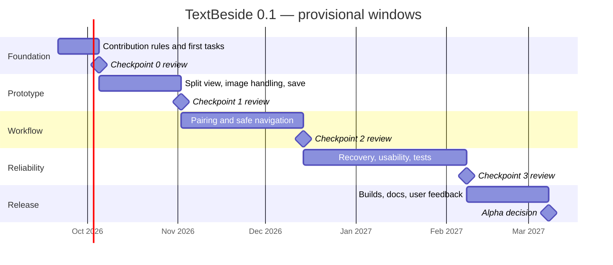

# Development roadmap

This is a working plan for a small, part-time project. The chart uses **provisional planning windows beginning 21 September 2026**, not release promises or assigned deadlines. Adjust the dates at each checkpoint as experience and available time become clearer. Progress is judged by the exit evidence in the linked GitHub issues, not by elapsed weeks.

| Checkpoint | Planning window | What it proves | Live progress |
| --- | --- | --- | --- |
| 0. Working agreement | 21 Sep–4 Oct 2026 | Contribution rules and first implementation tasks are ready | [#1](https://github.com/GeoffRiley/TextBeside/issues/1) |
| 1. Split-view prototype | 5 Oct–1 Nov 2026 | One image/text pair can be edited safely; zoom and pan feel good | [#2](https://github.com/GeoffRiley/TextBeside/issues/2) |
| 2. Pair navigation | 2 Nov–13 Dec 2026 | A directory of pages can be transcribed without mismatches or overwrites | [#3](https://github.com/GeoffRiley/TextBeside/issues/3) |
| 3. Daily use | 14 Dec 2026–7 Feb 2027 | A longer session is predictable and recoverable | [#4](https://github.com/GeoffRiley/TextBeside/issues/4) |
| 4. Alpha | 8 Feb–7 Mar 2027 | Another person can install and use 0.1 on Linux and Windows | [#5](https://github.com/GeoffRiley/TextBeside/issues/5) |

## How to use the plan

- The **README** states product scope and longer-term ideas. This page holds the provisional timing and links to live checkpoint issues. The issues hold current progress and evidence.
- Work on the **current checkpoint** first. Open small implementation issues as its acceptance checks become concrete. For checkpoint 1, begin with [window and package #6](https://github.com/GeoffRiley/TextBeside/issues/6), then [image interaction #7](https://github.com/GeoffRiley/TextBeside/issues/7) and [safe text saving #8](https://github.com/GeoffRiley/TextBeside/issues/8).
- A checkpoint is complete after a hands-on demonstration and its safety checks, with links recorded in the issue. Carry a missing feature forward only by documenting the scope change, not by silently ticking a box.
- Review estimates at each checkpoint. A slower, safe save path takes precedence over a calendar target.
- Phase 5 ideas in the README are a **post-alpha backlog**, intentionally without dates. Prioritise them after feedback.

GitHub's native milestones could later group the individual implementation issues and show completion percentages. The checkpoint issues here are the current source of truth; no native milestones have been created.
